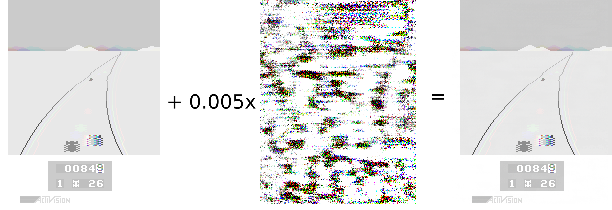

# nao-atari
Create Natural Adversarial Observations for Atari games

With the notebook provided in this repository, you will be able to recreate three attacks from my master thesis "Introducing natural adversarial observations to a Deep Reinforcement Learning agent for Atari games". 

So what do we see in the images? To the left, the plotted input the Atari agent will be presented with; a stack of 4 consecutive, grayscaled images from the game Enduro. We add the middle image, the calculated perturbation, and receive the adversarial observation to the right. Adversarial observation and original input are indistinguishable for humans, but the agent playing the game will be tricked into breaking and loosing score points.

The repository comes with three already trained agents for Enduro, Road Runner and Breakout. All of them outperform a human expert player.

## Requirements
The attacks were tested with the following packages installed
* [Python 3.8.3](https://www.python.org/downloads/release/python-383/)
* [PyTorch 1.7.0](https://pytorch.org/get-started/locally/)
* [gym\[atari\] 0.17.2](https://gym.openai.com/docs/)
* [numpy 1.18.1](https://pypi.org/project/numpy/1.18.1/)
* [matplotlib 3.2.2](https://matplotlib.org/3.2.2/users/installing.html)

